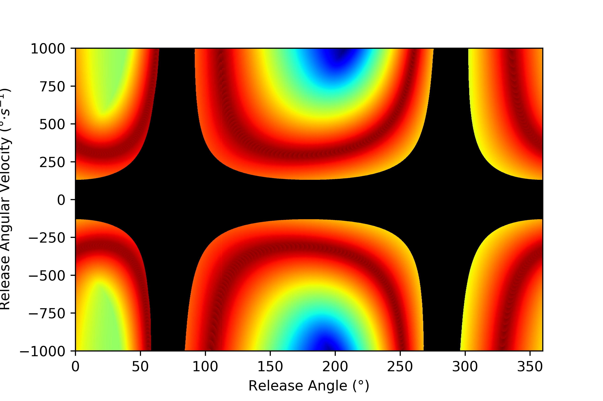

# Skittles Task Environment

Repository for a Unity implementation of the "skittles" virtual throwing task originally proposed in (Müller & Sternad, 2004), and more recently used in Zhang et al. (2018). This environment is designed to be used with a computer mouse to facilitate remote data collection or prototyping.

## Acknowledgement

This repository is associated with a published abstract submitted to [COGSCI2022](https://cognitivesciencesociety.org/cogsci-2022/). Please use the following citation when referencing this repository:

Nalepka, P., Schell, G., Patil, G., & Richardson, M. J. (2022). A computer mouse-based throwing task to study perceptual-motor skill learning in humans and machines [Abstract]. *Proceedings of the Annual Meeting of the Cognitive Science Society*, *44*.

Perceptual-motor tasks offer redundant solutions to achieve a goal. However, not all solutions are equally robust to error-producing noise or variability and thus, skill learning can be viewed as a search process to identify behaviors that are error-tolerant. Throwing a ball to hit a target is one such example of a complex perceptual-motor skill that has been studied in the laboratory via the virtual “skittles” task, a simplified 2D task involving throwing a tetherball around a pole to hit a target. We implemented the task as a Unity3D environment (code here: https://github.com/ShortFox/SkittlesTaskEnvironment/) which enables participants to complete the task with a computer mouse and replicated key findings from previous research. Our implementation allows for remote data collection and can serve as a pedagogical tool to teach concepts in skill acquisition. Future work will use this task to explore human versus machine skill acquisition by leveraging Unity’s MLAgents reinforcement learning package.

## Environment

The task environment can be found [here](https://github.com/ShortFox/SkittlesTaskEnvironment/tree/main/Unity). This project was tested using [Unity 2019.4.4f](https://unity3d.com/get-unity/download/archive).

## Demo

The task can be played online using Unity's WebGL [here](https://shortfox.github.io/SkittlesTaskEnvironmentDemo/).

The solution manifold for the task environment is pictured below:

Note: 0° release angle equates to the 12 o'clock position (90° equates to the 3 o'clock position, etc.). Positive angular velocity represents clockwise movement.

## References

1. Müller, H., & Sternad, D. (2004). Decomposition of Variability in the Execution of Goal-Oriented Tasks: Three Components of Skill Improvement. Journal of Experimental Psychology: Human Perception and Performance, 30(1), 212–233. https://doi.org/10.1037/0096-1523.30.1.212
2. Zhang, Z., Guo, D., Huber, M. E., Park, S.-W., & Sternad, D. (2018). Exploiting the geometry of the solution space to reduce sensitivity to neuromotor noise. PLOS Computational Biology, 14(2), e1006013. https://doi.org/10.1371/journal.pcbi.1006013

## Contact

If you have any questions or would like to discuss this research, please contact Dr. Patrick Nalepka ([ShortFox](https://github.com/ShortFox)) at <patrick.nalepka@mq.edu.au>.
